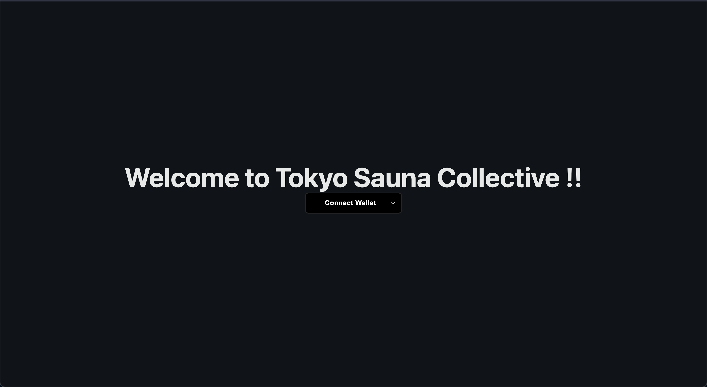

   
  
   
   
  

 

 

## • Overview

This project is made following [this instructions](https://app.unchain.tech/learn/ETH-DAO/) made by engineer cmmunity `UNCHAIN`. This one is one of the best one to learn blockchain development.

This is dapp that you can send message and wave to the board. Also, if you're lucky, you can receive token(testnet token) from this contract.

## • Links

[Deployed here](https://eth-dao-mu.vercel.app/)

## • Launch

1. run `yarn install` in terminal.

2. Finally, run `yarn client start` in terminal and see how it works!
